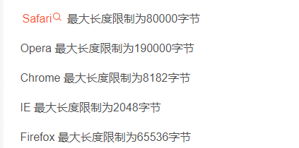
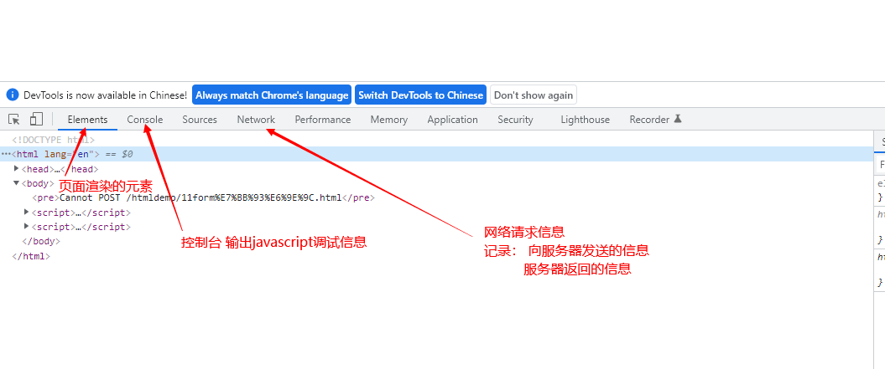
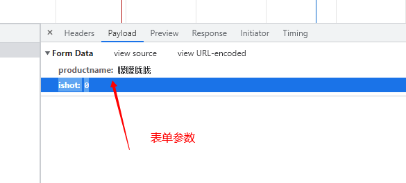
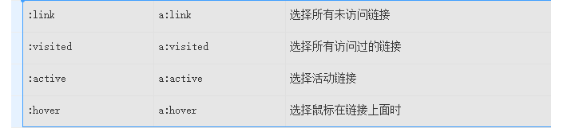
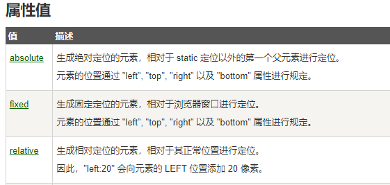

# HTML

* html 

* xml  (Extensible Markup Language)  可扩展的标记语言     

  > <姓名>张三</姓名>

<标记>  </标记>

php    jsp   asp  

> <%
>
>   String s="hello";
>
> %>
>
> php黄金组合：  lamp   linux+apache+mysql+php  
>
> sun公司最先推出的是servlet  服务端的小程序  ----jsp  
>
> asp  微软 
>
> c#  微软面向对象的语言  
>
> c语言  面向过程的语言  
>
> c++   面向对象的语言  （开发游戏 ）
>
> java  sum  jsp 
>
> asp--C#    .net  ---asp.net  
>
> python 
>
> 计算机最小存储单位：  bit  位  它的值只有0或1  
>
> 1字节= 8bit    

概念：

* 域名  ip地址的别名  

* IP   

  > ipv4  由4组数据，每组数据范围0-255     192.168.13.80
  >
  > ipv6  由6组数据   每组数据由4位  字母或数字组成 （26+10）

* DNS  解析  

html标记 ----html标签 -----html元素 

页面组成：

根元素： html

直接子元素：

* head 

  > 这里设置跟页面相当的  内容   如：编码方式  

* body  

视口

编码：

   ssss-----转换成01010100

 规则：  ascii 码   用一个字节存储  8位  可以表示256种符号  

  a ----97   

  b---98

国内：  91251 

 gb2312 ----中国的编码方式   2个字节  16位 256*256

 gbk  

utf-8  3个字节  256*256* 256

mysql  低版本  默认安装的是ascii码 

## 标签

     显示图片  

块元素：

> 独占一行  

* div    
* p  
* ul 
* ol
* br

行内元素：  

* span   

form元素：  

常见的请求方式：

* get 请求    

  > 请求参数显示在地址栏中，形式：  url  ?  参数名=参数值  &    参数名=参数值
  >
  > 

* post   参数以form data形式传递   不会在地址栏显示   内容长度不限制  

  >   

​     

富文本编辑框

gender  

请求：

* 同步   将请求提交给服务器  等待服务器返回结果    如果时间很长  你看到一片空白  
* 异步   

ajax 请求  

input元素类型：

* text   文本框  
* password  密码框  
* number   数字框   
* file  上传文件   
* submit (了解)
* button  
* reset  
* radio  
* checkbox   

驼峰明明法：

userName  (小骆驼命名法)

UserName(大骆驼命名法 )

短横线命名法 ：单词之间用短横线

user-name

css注释语法：  /*    多行注释  */

## 选择器

* 元素选择器   直接使用html标签名称做为选择器  
* 类选择器    .样式名称        元素引用时通过class="样式名称"
* id选择器      #元素id的值    {}   
* 包含选择     元素A  元素B     
* 多元素  设置相同的样式   多元素之间用逗号 隔开
*  

## 属性

###   背景 

* background-color  背景颜色  

* background-image 背景图片  

  > background  是上面两个的  综合应用   

* background-repeat 背景重复 

### 外边距

  margin-*    设置元素距离它的父容器的距离 

* left 
* top 
* right 
* bottom

margin的值：

* 一个值   设置的是所有的边距
* 两个值   第一个代表上下边距   第二个代表左右边距
* 4个值   分别代表 上  右  下  左  （顺时针转一圈）
* auto  居中

### 居中

* text-algin   水平居中
* vertical-align  垂直居中

### 边框

border-*   设置边框

* left 

* top   简化方式 border-top:  颜色  边框样式  边框宽度   (三个值顺序没有要求，但值之间必须用空格隔开)

  > 效果等同于
  >
  > ​    border-top-color: #E1251B;
  > ​	border-top-style: dotted;
  > ​	border-top-width: 1px;

* right

* bottom  

  同时设置4个边框：

  border: 颜色  边框样式  边框宽度   (三个值顺序没有要求，但值之间必须用空格隔开

  > 等同于：
  >
  >    border-top: #E1251B solid 1px ;
  > 	border-left:  #E1251B solid 1px ;
  > 	border-bottom:  #E1251B solid 1px ;
  > 	border-right:  #E1251B solid 1px ;

> 边框属性：
>
> 1. color   设置边框线的颜色 
> 2. width  设置边框线的宽度 
> 3. style  设置边框线的样式  
>    * solid   实线 
>    * dashed 虚线  
>    * dotted  点线 
>    * none 去掉边框线 
> 4. outline  设置外边框线  

 

行内元素：直接设置width  height 无效 

display:

* block   将元素设置为块元素 
* inline  将元素设置为行内元素 
* inline-block 设置为行内块元素  

position: 

-webkit   chrome  safari

-ms  ie9  

-mon  firefox   

position: 

* absoulte  

  > 1. left  
  > 2. top 
  > 3. right 
  > 4. bottom  

* fixed  

* relative  

