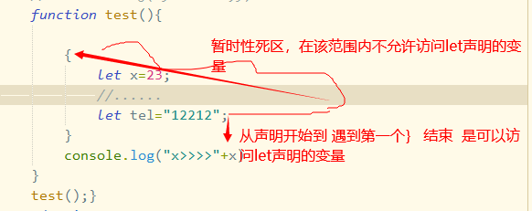
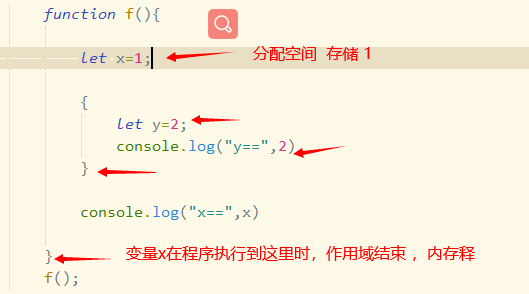
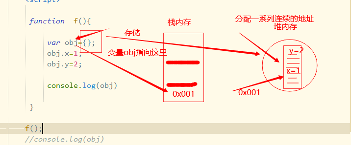
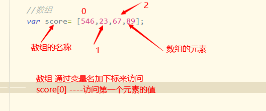
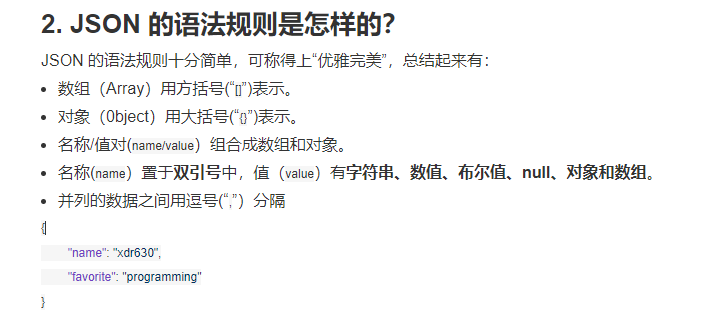
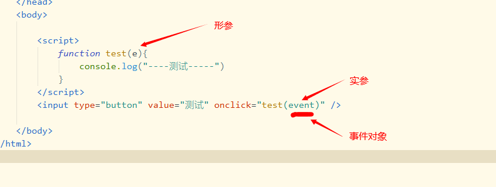

# javascript

javascript  java  什么关系 ？

vbscript  

flex  -----silverlight

## 基础

###    注释语法 

* 单行注释    //  
* 多行注释    /*       */

### 函数

​      是一系列语句组成的代码块  

变量的作用哉

变量的提升

### 变量声明的语法 

* var   声明变量 

  > 语法：    var  变量名=变量值     

  0061--->  6*16的一次方+1+16的0次方==97

javascript是一种弱类型的语言  (变量的类型由值来决定)

> java就是强类型语言 
>
> String s;
>
> int i;

### 标识符

​     凡是你可以命名的地方，都是标识符，如变量名、函数名、参数名  

* 以字母、下滑线、$开头    
* 有意义的字符串   
* 保留的关键字不能做标识符  

命名规则：

1. 驼峰命名法 
   * 小骆驼命名法    第一个单词首字母小写，其它单词首字母大写  如 userName  （通常用于变量或函数）
   * 大骆驼命名法   每个单词首字母大写   如UserName   (通常用于 class)
2. 短横线命名法    多个单词用连接符连接在一起    user-name(js不适用 ) 

## 变量 

​        变量是内存存储中的一块空间，操作变量就是操作空间中的值  

1. 正常情况 下    先声明后使用  

2. 变量具有提升作用 

   >  js在在编码运行之前，会将变量的声明提到最前面 ，然后初始化为undefined  

代码块：   {}  

* var  

  > 1.  使用var 在函数外部声明的变量是  全局变量    会增加到window对象上  
  > 2. 在函数内部声明的变量  仅在函数内可见  局部变量  
  > 3. 变量未声明直接使用   属于全局作用域   
  > 4. var 声明的变量不具有代码块作用域  
  > 5. var声明的变量具有提升作用  会在js编译时 将var声明的变量 提到最前面 

* let  

  > 1.  let 在函数外部声明的变量 属于全局变量（当前代码块的全局变量）  （不能通过window来引用变量 ）
  > 2. let 在同一作用域内不允许重复声明   
  > 3. let 具有代码块作用域  它声明的变量只能在它所在的代码块内使用  
  > 4. 不具有变量提升  具有暂时性死区

* const  

  > 1. 声明常量 时，要初始化，且不允许被重新赋值
  > 2. 它声明的全局常量   不会添加到window对象上  
  > 3. 具有代码块作用域  ，在同一作用域内不允许重复声明  
  > 4.  const声明的对象，可以更改对象的属性，但不允许重新赋值

  在一个函数内嵌套其它函数，来实现变量共享  

## 数据类型

  基本数据类型：存储在栈内存空间  ，一旦作用域结束，它所占的空间会立即释放  

引用类型：变量在栈内存存储,值在堆内存中存储  

区分：

> y is not defined    说明变量不存在 
>
> undefined   变量存在，它的值是undefined  

对象： 是一组属性的无序集合  ，属性的值可以是基本数据类型，也可以是引用类型  

> 在对象中定义的变量称为属性 
>
> 在对象中定义的函数称为方法   

## 事件

三部分组成：

* 事件源 
* 事件类型
* 处理函数 

事件中都有一个event参数，包含着事件源 事件类型...

两种方式

* 属性注册 

  > 1. 处理函数中  this默认指向  window对象
  > 2. 所有浏览器都适用  

* 事件监听

  > 1. 处理函数中  this指向事件本身 
  > 2. ie8之前不兼容  （可以使用attachEvent来处理 ）

常用事件：

1. onclick 鼠标点击事件  
2. ondblclick 双击事件  
3. onfocus 聚焦 （用户输入信息时错误或没有输入时，让对应文本框获得焦点 ，等待输入信息 ）
4. onblur的失焦事件   (应用：注册是检测用户输入的用户名是否可用)
5. onchange  改变事件 （应用：  下拉列表  ）
6. oninput  输入事件   
7. 鼠标事件  onmouse*
8. 键盘事件  onkey*
9. onload 页面加载完执行 

## DOM

   查找元素

* 根据id查找   getElementById()

